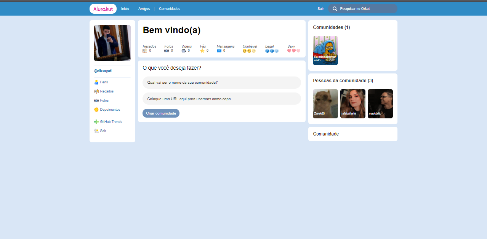
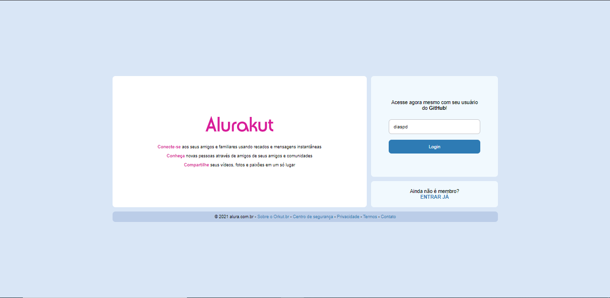

<h1 align="center">
  Alurakut
</h1>


<p align="center">
  <a href="#-Technologies"><b>Technologies</b></a>&nbsp;&nbsp;&nbsp;|&nbsp;&nbsp;&nbsp;
  <a href="#-Project"><b>Project</b></a>&nbsp;&nbsp;&nbsp;
</p>

<br>

<div align="center">
  
</div> 


<div align="center">
  
</div>


## 🚀 Getting started

Clone the project and access the folder.

```bash
$ git clone https://github.com/diaspd/alura-kut.git
$ cd 
```

Follow the steps below:
```bash
# Install the dependencies
$ npm i

# Start the project
$ npm run dev
```
The app will be available for access on your browser at http://localhost:3000

<br></br>

## 💻 Technologies

This project was developed with the following technologies:

<b>
  
- JavaSript
- ReactJs
- Nextjs
  
</b>

<br></br>

## 📄 Project
💰A project similar to an old social network, Orkut.
<br></br>


Made with ♥ by Pedro Dias. 👋 Follow me on social media!

If you can give a little star, I appreciate it 🤩
